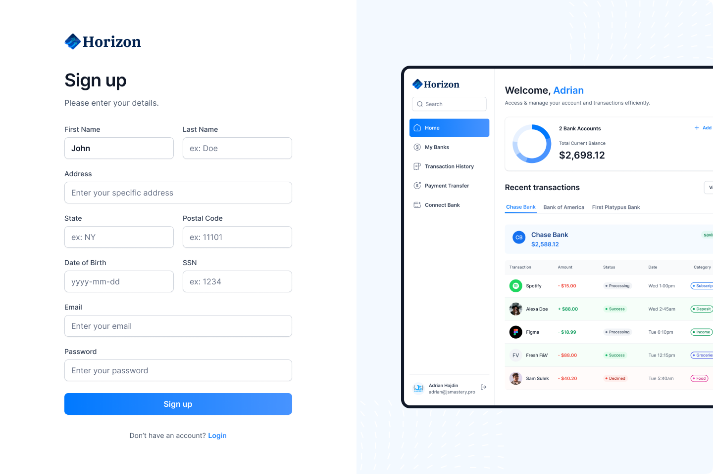
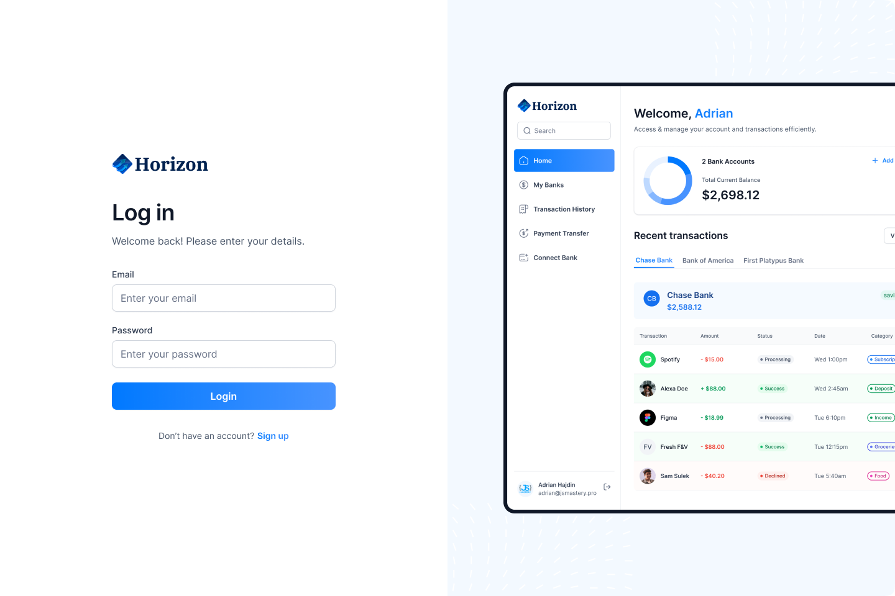
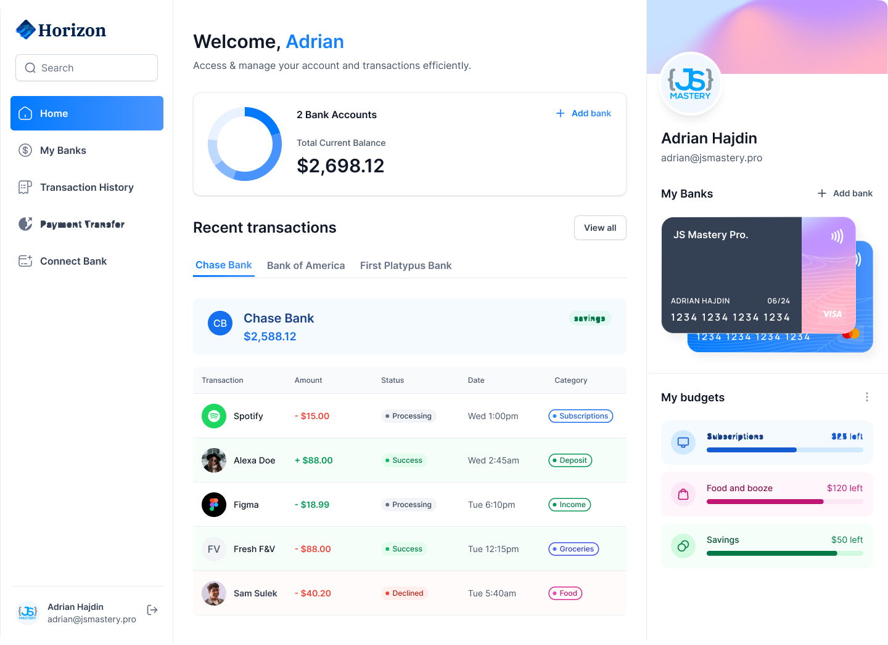
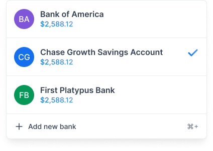

# Design Document for the Horizonal Bank Application

### Synopsis
A Horizonal Bank financial application is being developed to streamline and simplify various banking functionalities for users. The application will allow users to transfer funds, view transaction history, manage digital cards associated with their accounts, and automatically create an account upon registration and login. This application aims to provide a seamless and efficient experience for users, leveraging modern technologies and design practices to achieve these goals.

## User Stories
#### Customer Stories
Alice the User
Meet Alice, a young professional working in the tech industry. She values convenience and security when it comes to managing her finances. She has several requests for the development team.

As a User, I want to be able to register and automatically have a bank account created for me.
As a User, I want to log in and be presented with a dashboard that shows my account balance, recent transactions, and digital cards.
As a User, I want to be able to view my transaction history and filter it by date, amount, and transaction type.
As a User, I want to be able to transfer funds to another account and receive a confirmation once the transfer is successful.
As a User, I want to be able to manage my digital cards, including viewing card details, setting spending limit.

#### Bob the User
Meet Bob, a small business owner who needs to manage multiple accounts efficiently. Bob has specific requirements for the app.

As a User, I want to be able to create multiple accounts and switch between them easily.
As a User, I want to receive notifications for transactions made from my accounts.
As a User, I want to be able to generate and download detailed transaction reports for my accounts.
As a User, I want to have the ability to categorize my transactions and view spending summaries.

### Technology Stack

- Frontend: **React JS**
- Backend API: **Spring Boot with Spring Data JPA using Hibernate and the PostgreSQL Driver**
- Security and Auth: **Spring Security using JWT for user authentication and session management**
- Database: **PostgreSQL for a relational database**

## Domain Objects (Entities / DTO / ENUM)

### User
- accountId: Long 
- firstName: String
- lastName: String
- password: String 
- email: String 
- accounts: List<Account>
- authorities: List<Authority>
- address: String
- dateOfBirth: Date
- postalCode: Long
- state: String
- SSN: Long

### Authority
- accountId: Long
- authority: String 
- users: List<User>

### Account
- accountId: Long 
- accountNumber: String
- accountName: String
- creationDate: date
- balance: Double 
- user: User 
- transactions: List<Transaction>
- digitalCards: List<DigitalCard>
- accountType: String
- isActive: Boolean

### Transaction
- accountId: Long 
- transactionType: String (Withdraw, Deposit) 
- amount: Double 
- date: Date
- category: String
- remarks: String 
- account: Account 
- status: String
- recipientAccountNumber: String (Optional for fund transfers)

### DigitalCard
- accountId: Long 
- cardNumber: String 
- cardType: String 
- expirationDate: Date 
- cvv: Integer 
- account: Account 
- status: String (Active, Frozen)

### DTOs
- UserResponseDto 
- AccountResponseDto 
- TransactionResponseDto 
- DigitalCardResponseDto 
- TransferRequestDto 
- RegistrationRequestDto 
- LoginRequestDto

### Enums
- TransactionTypeEnum 
- AccountStatusEnum 
- CardStatusEnum 
- AuthorityEnum
- AccountTypeEnum

### Database Tables
#### users
- accountId: number
- first_name: varchar
- password: varchar
- email: varchar
- last_name: varchar
- address: varchar
- state: varchar
- ssn: number
- postal_code: number

#### authorities
- accountId: number 
- authority: varchar
- user_roles
- user_id: number
- role_id: number

#### accounts
- accountId: number
- account_number: varchar
- account_name: varchar
- creation_date: date
- balance: decimal
- user_id: number
- card_id: number

### transactions
- accountId: number 
- transaction_type: varchar 
- amount: decimal 
- date: timestamp 
- account_id: number 
- recipient_account_number: varchar

#### cards
- accountId: number 
- card_number: varchar 
- card_type: varchar 
- expiration_date: date 
- cvv: number 
- account_id: number 
- status: varchar

### Restful Endpoints
- **Register User**                                               `/api/auth/register`
- **Login User**                                                `/api/auth/login`
- **Validate Token**                                          `/api/auth/validate`
- **Get User Accounts**                                     `/api/accounts`
- **Get Account By Id**                                   `/api/accounts/{accountId}`
- **Get Transactions By Account**                       `/api/transactions?accountId={accountId}`
- **Transfer Funds**                                  `/api/transactions/transfer`
- **Get Digital Cards By Account**                                `/api/digital-cards?accountId={accountId}`
- **Freeze/Unfreeze Digital Card**                                `/api/digital-cards/{accountId}/status`
- **Generate Transaction Report**                                 `/api/reports/transactions?accountId={accountId}&startDate={startDate}&endDate={endDate}`
- **Safe delete account**                                    `/api/account/{accountId}`

## Figma

### SignUp Page

### Login Page

### DashBoard Page

### My Card Page

### Transaction History Page

### My Account Page

### Transfer Funds Page
